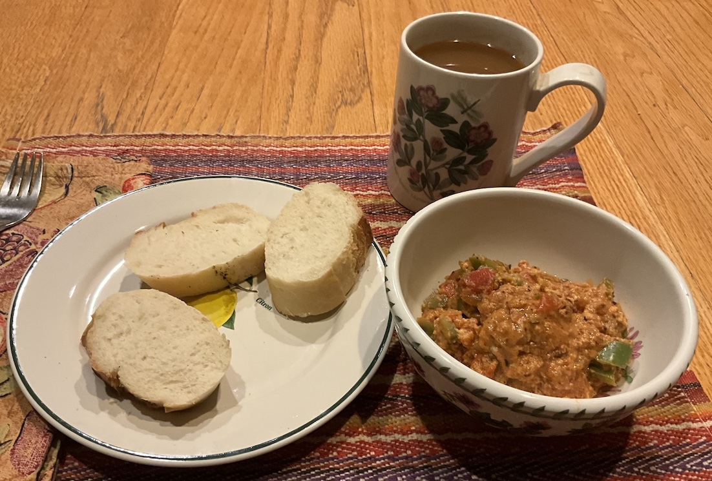

[prev](tunisia.md)&emsp;
[top](../index.md)&emsp;
[next](turkmenistan.md)
# Turkey
10 November, 2024

Turkish breakfast: menemen. This is very similar to
[shakshuka](../i/israel.md), but with a bit less emphasis on tomato.
Stewed vegetables, served optionally with sliced baguettes.  We both
liked this a lot, and it is very easy to make. Almost certainly up for
a repeat at some point.

[recipe](https://www.themediterraneandish.com/menemen-recipe/) 
The baguette is from Maggie Glazer's _Artisan Bread_.

