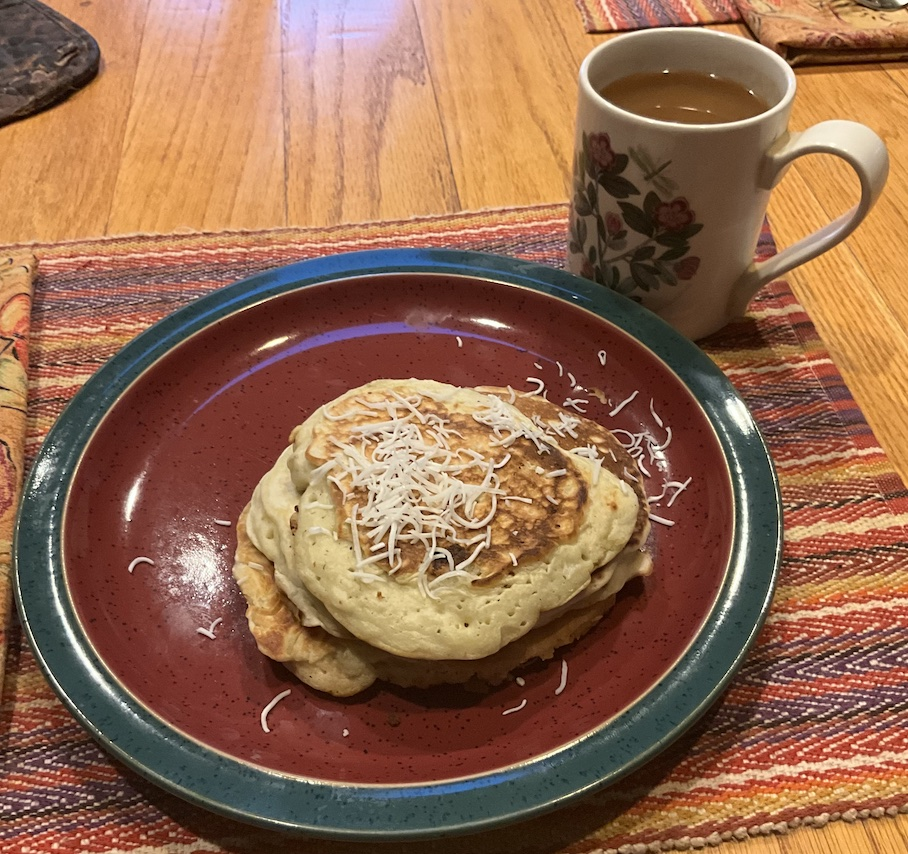

[prev](turkmenistan.md)&emsp;
[top](../index.md)&emsp;
# Tuvalu
24 November, 2024

Tuvaluan breakfast: coconut pancakes. This was a weird one. I research
these recipes, sometimes weeks in advance. For Tuvalu, it was very
hard to find any recipes at all. (Maybe they're a secretive people? I
don't know.) Anyway, by the time I got around to making this, the web
site that had the recipe I'd found had been taken down. Sigh. So I did
the one below, with a few tweaks to get closer to what I remembered
from the other recipe.

They were delicious, but likely not very authentic to the culture.

[recipe](https://celebratingsweets.com/coconut-pancakes/) 

