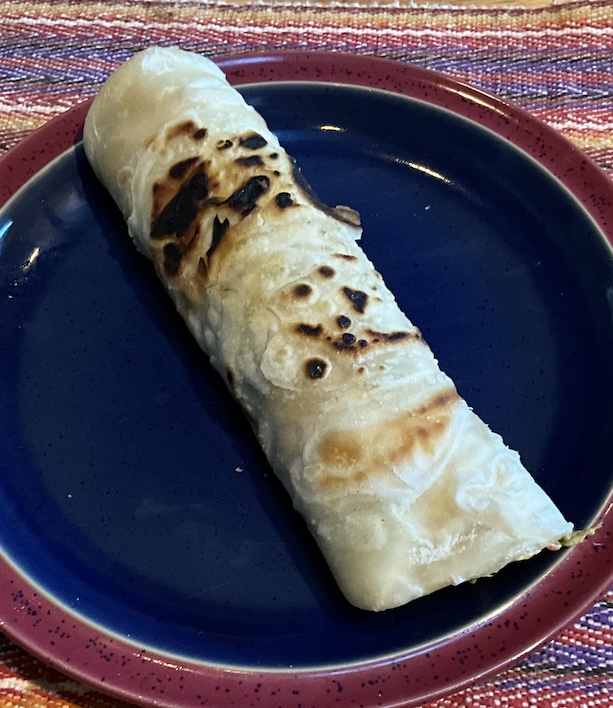

[prev](../t/tuvalu.md)&emsp;
[top](../index.md)&emsp;
[next](ukraine.md)
# Uganda
1 December, 2024

Ugandan breakfast: Rolex. This is basically a vegetable omelet rolled
up in a chapati. Sort of Uganda's answer to the breakfast burrito, but
my wife likes this a lot more. The recipe is for one serving, and it
is plenty; neither one of us was particularly hungry for lunch.

The recipe author says that when street vendors were trying to sell
this, they would call out "rolled eggs". Tourists misunderstood what
they were saying, and the mishearing eventually became the name of the
dish.  Nice little anecodote.

Recipes: 
[chapati](https://cheflolaskitchen.com/east-african-chapati/) 
[rolex](https://globaltableadventure.com/recipe/ugandan-rolex-breakfast-wrap/) 

