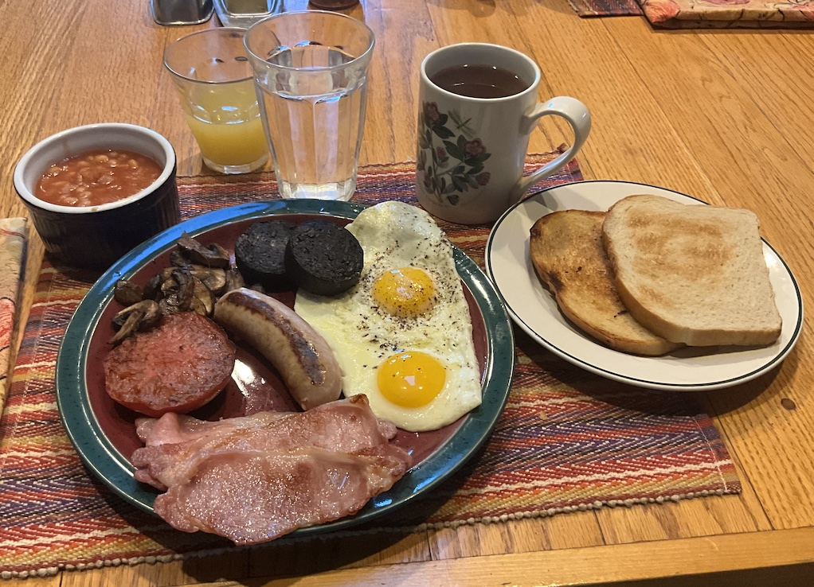

[prev](united_arab_emirates.md)&emsp;
[top](../index.md)&emsp;
[next](united_states.md)
# United Kingdom
22 December, 2024

British breakfast: full English. Whoo boy howdy, this was a lot of
food. Half an hour to prepare, an hour to eat, and two hours to sit on
the couch recovering. I've heard about people who eat this every week,
or even every day, and I just don't understand how that's possible. I
did the minimum serving; if you go to the procedure page, there is a
list at the bottom of optional add-ons. But really, why?

The link below isn't really a recipe, since everything is bought
pre-made, I just fried it all. But it does give a very helpful
structure for doing everything, and I found it invaluable.  Note that
it doesn't say when to do the eggs, so I just did them at step four.

[procedure](https://englishbreakfastsociety.com/english-breakfast-recipe.html) 

