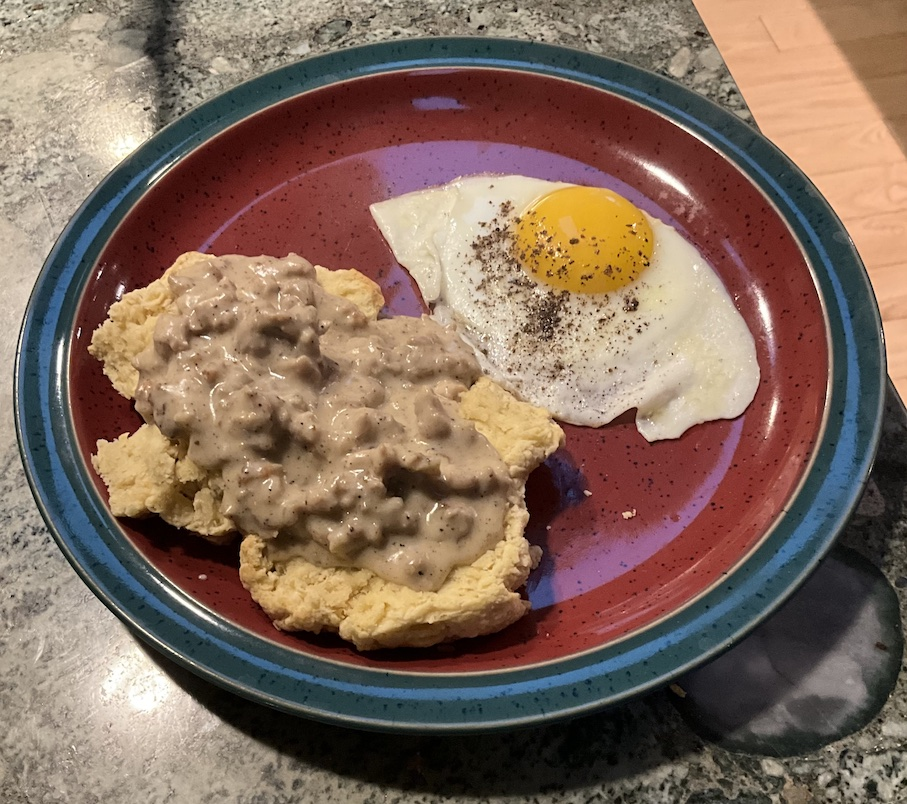

[prev](united_kingdom.md)&emsp;
[top](../index.md)&emsp;
[next](uruguay.md)
# United States
29 December, 2024

American breakfast: biscuits and gravy. Americans have a wide variety
of foods for breakfast, but in my estimation, biscuits and gravy is
the one that is most uniquely American. Anyway, it's a family
favorite, so I'll take any excuse to make it.

The gravy recipe is my own tweak on classic sausage gravy. I've been
making this at home for years, and this is the formulation I settled
on.

Recipes 
[gravy](gravy.md) 
[biscuits](https://smittenkitchen.com/2013/03/my-favorite-buttermilk-biscuits/) 

