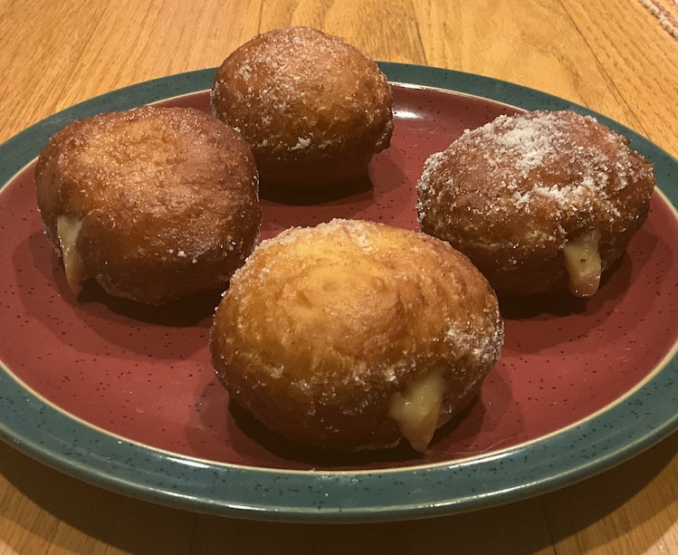

[prev](united_states.md)&emsp;
[top](../index.md)&emsp;
# Uruguay
5 January, 2025

Uruguayan breakfast: boria de fraile. Doughnuts filled with dulce de
leche, accompanied with coffee. A pretty classic breakfast, but it was delicious.

I made a quarter recipe and got 5 doughnuts, which is enough for 2-3 people.

Recipes: 
[boria de fraile](https://recetasargentinas.org/las-bolas-de-fraile/) 
[dulce de leche](https://www.tasteofhome.com/recipes/dulce-de-leche-recipe/) 

