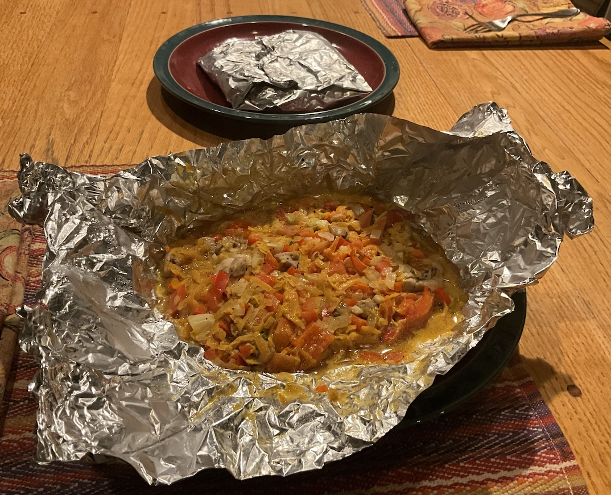

[prev](../u/uzbekistan.md)&emsp;
[top](../index.md)&emsp;
# Vanuatu
19 January, 2025

Vanuatuan breakfast: laplap. Chopped and grated veggies, steamed in
little packets. It's supposed to be banana leaves, but I have trouble
sourcing those, so I used aluminium foil as a substitute. Because it
was (mostly) vegetarian, we were hungry again before lunch time, but
it tasted good. I served it with a side of sliced pineapple.

[recipe](https://www.atravel.blog/post/laplap) 

