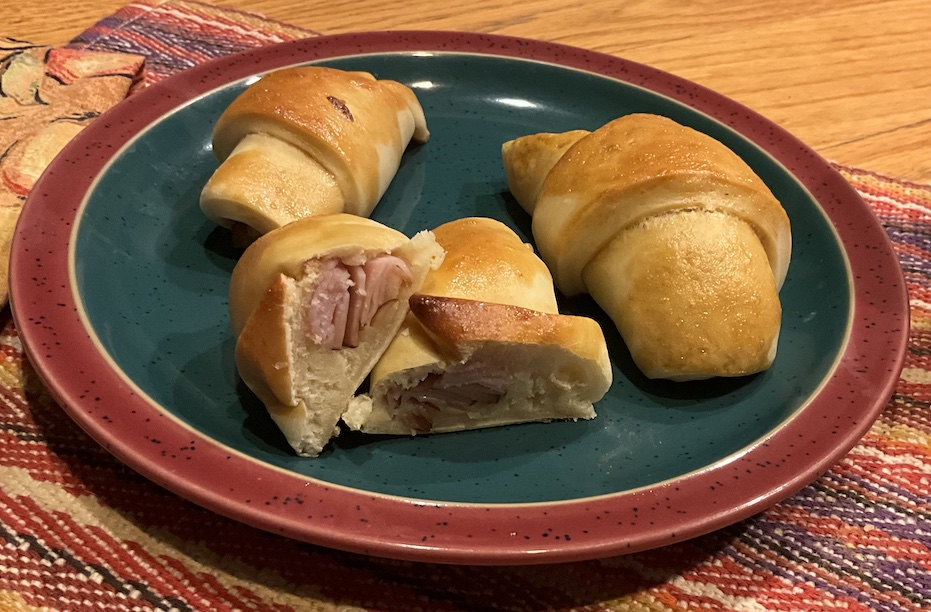

[prev](vatican_city.md)&emsp;
[top](../index.md)&emsp;
[next](vietnam.md)
# Venezuela
5 February, 2025

Venezuelan breakfast: cachitos de hamon. Crescent shaped rolls stuffed
with ham. Very good. Lots of butter and sugar in the dough, so four
rolls apiece was plenty.

Some notes, in case you try to make this: The recipe makes enough to
serve 8-10 people. The amount of ham in the recipe is way off; you
should chop it as you form the rolls, not all at once. I think I used
about half of what I had.

[recipe](https://blog.amigofoods.com/index.php/venezuelan-fooods/cachitos/) 

