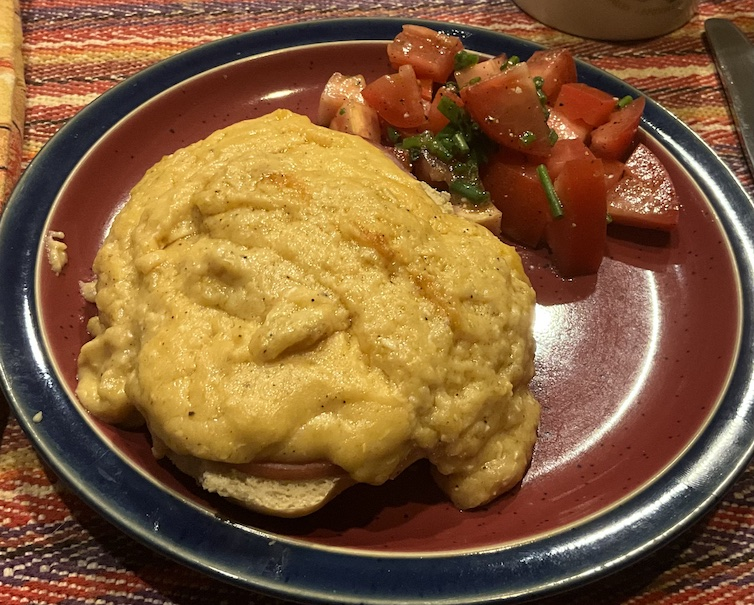

[prev](../v/vietnam.md)&emsp;
[top](../index.md)&emsp;
[next](../y/yemen.md)
# Wales
30 March, 2025

Welsh breakfast: rarebit. This. Was. Awesome. So easy to make, and
just fabulous. Not a figure friendly dish, so best reserved for
special occasions, but man was it tasty. And it was plenty of food, no
getting hungry before lunchtime.  The cheese sauce had a rich earthy
umami thing going on that I realy dug.

[recipe](https://www.jamesmartinchef.co.uk/recipes/welsh-rarebit-with-bacon/) 
The bread was from Peter Reinhart's <i>The Bakers Apprentice</i>.

