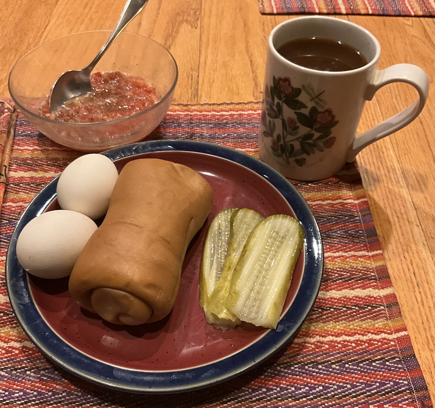

[prev](../w/wales.md)&emsp;
[top](../index.md)&emsp;
[next](../z/zambia.md)
# Yemen
16 February, 2025

Yemeni breakfast: jachnun. This was a little strange on my palate. The
eggs tasted kind of like hard boiled, but there was a strange
aftertaste, and the yolks were a little green at the edge, which is
not a good sign.

The pastry was very dry; perhaps I didn't use enough ghee when making
them. It was OK with the tomato dip, but not good enough for me to
make this again.

Recipes: 
[jachnun](https://jamiegeller.com/recipes/homemade-jachnun-from-scratch/) 
[tomato dip](https://jamiegeller.com/recipes/yemenite-tomato-dip/) 

