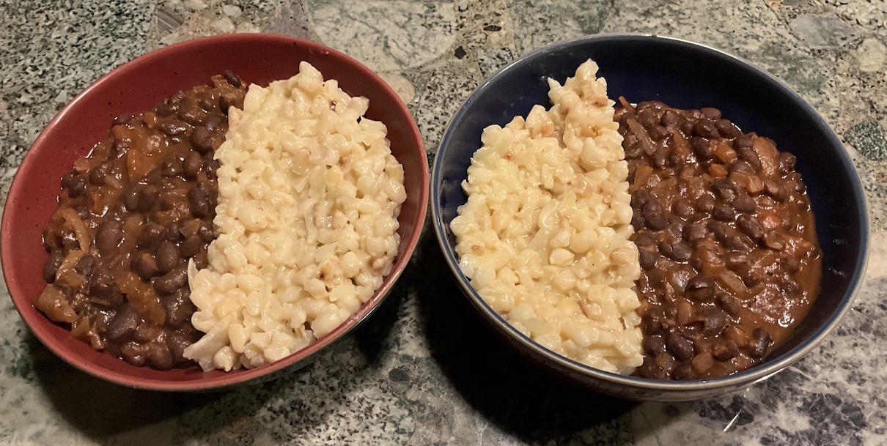

[prev](../y/yemen.md)&emsp;
[top](../index.md)&emsp;
[next](zimbabwe.md)
# Zambia
23 February, 2025

Zambian breakfast: samp. This one was pretty tasty. The samp itself
tasted like popcorn to me.  If you decide to try this, I recommend you
find a different recipe. This one was a little hard to follow; I think
it was meant to be made from canned samp or something, because as
written, there's no way the dried samp would have been cooked.

The beans were pretty good. I think if I made this again, though, I
would add a bit more spices and seasoning to them; they could have
been better.

Recipes: 
[samp](https://www.foodandhome.co.za/recipes/how-to-cook-creamy-samp) 
[beans](https://zambiankitchen.com/dried-beans-recipe/) 

