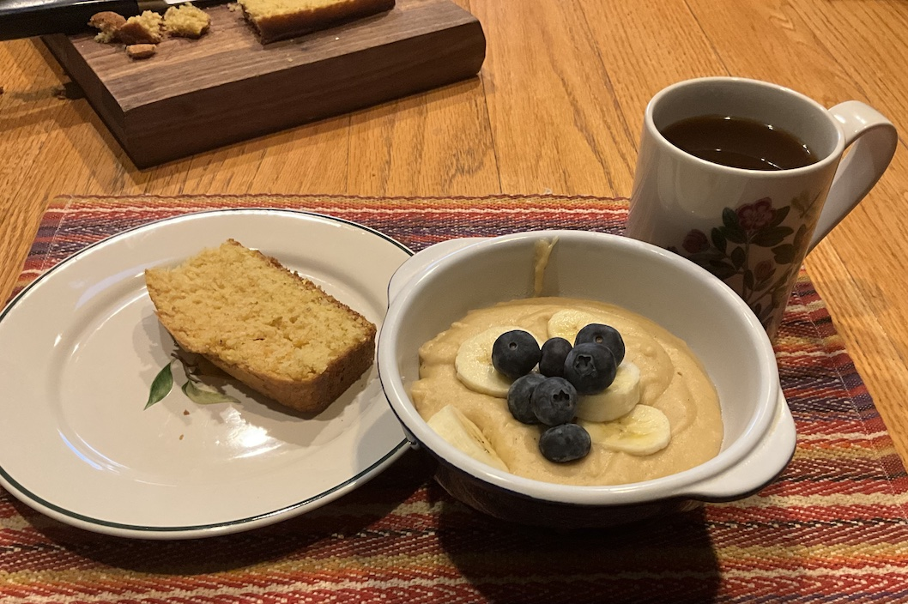

[prev](zambia.md)&emsp;
[top](../index.md)&emsp;
# Zimbabwe
2 March, 2025

Zimbabwean breakfast: chimodho and peanut butter porridge. This was a
good hearty breakfast, we both liked it a lot. The chimodho (corn
bread) was especially good, and pretty easy to make.

Recipes: 
[chimodho](https://www.zimbokitchen.com/zimbabwe-traditional-mupotohayi-a-k-a-chimodho-cornmeal-bread/) 
[porridge](https://www.thespruceeats.com/peanut-butter-porridge-bota-une-dovi-39487) 

